# Online Code Evaluation System

### Development Environment
- Java Version: Jdk 17
- Databases: MySQL 8.0, Redis 6.2.6
- Development Tools: IntelliJ IDEA, Maven 3.8.6

### Adopted Technologies
- Spring Boot, MyBatis-Plus, Redis
- Vue3, Axios, Element Plus

### Deployment and Runtime Environment
- Centos7

### System Architecture Design

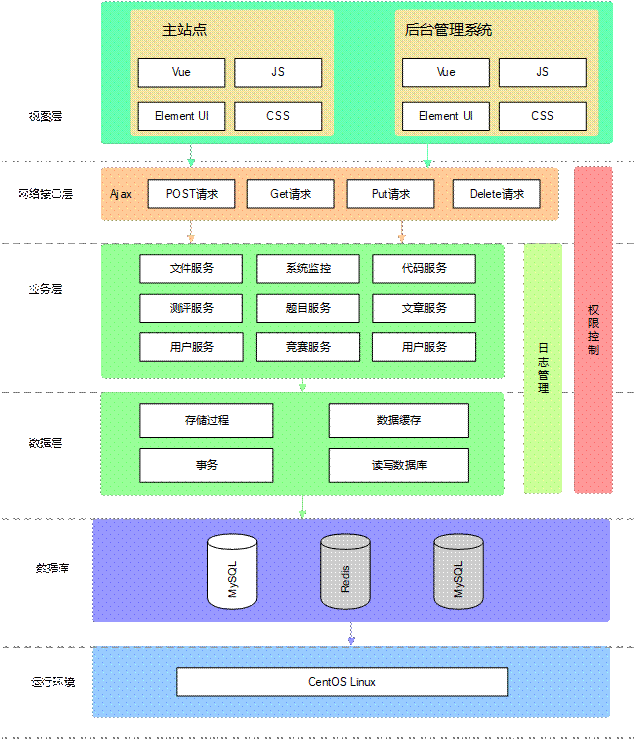

The view layer consists of the main website and the background management system. The main website is responsible for providing services to users and represents the system interface that users see. Users can perform main operations such as registration, login, personal information management, viewing questions, writing code, submitting code, checking evaluation status, viewing rankings, participating in competitions, checking competition results, and publishing articles. The background management system is a management backend specifically for system administrators. Administrators can manage users, questions, competitions, logs, and view the system's running status. The view layer interacts with backend interfaces through Axios for data exchange.

The network interface layer's main responsibility is to receive user requests and provide different responses based on the request parameters. The response data is in JSON format.

The business layer includes functional modules such as user service, question service, competition service, code service, evaluation service, file service, and article service. The business layer mainly contains the code that implements the system's functions. It interacts with the data layer through data mapping to achieve data persistence.

The data layer is the bottom - most and most important layer of the system. All data in the system is stored in the MySQL and Redis services of the data layer.

### System Overall Design

This system is mainly divided into two main modules: the user module and the administrator module. The user module includes multiple sub - functional modules such as registration, login, personal center, question browsing, code evaluation, competition participation, and article publishing. The administrator's functional modules include user management, question management, evaluation management, competition management, and article management. The detailed functional module division diagram of this system is shown in the figure below.

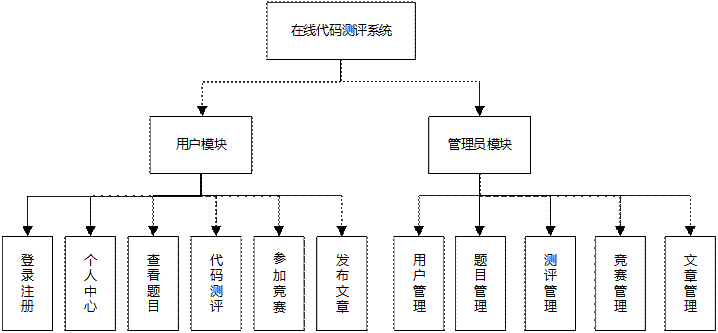

#### Code Evaluation Flowchart

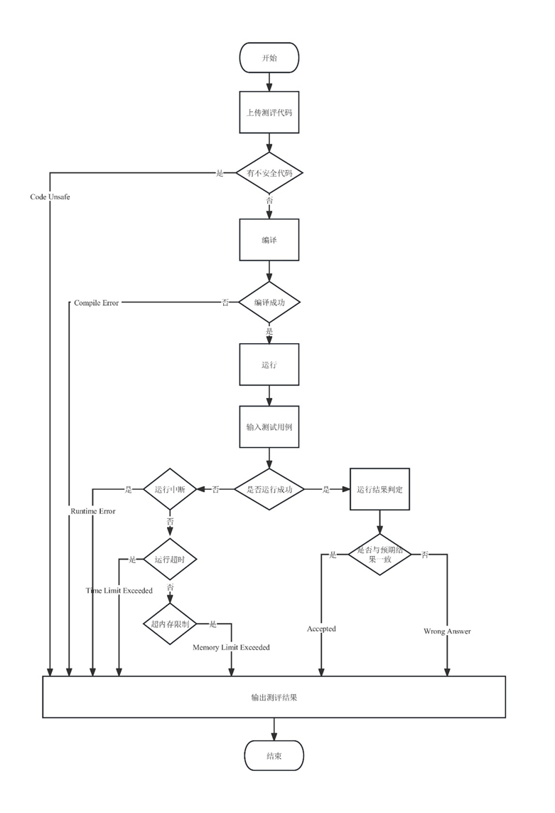

Evaluation Result Design:
- Compile Error: There are syntax errors in the code submitted by the user, and it cannot pass the compiler's check.
- Partial Accepted: The user's submitted source code can pass some test cases, but there are still some test cases that cannot be passed. The user needs to consider other possibilities.
- Accepted: The user's submitted source code has passed all the test cases after testing, indicating that the user has solved the problem.
- Wrong Answer: The output result of the user's submitted source code is incorrect, and it fails to pass any of the test cases.
- Runtime Error: The program terminates abnormally during runtime. Possible reasons include segmentation faults, division by zero, stack overflow, or array out - of - bounds errors.
- Time Limit Exceeded: The user's submitted source code exceeds the maximum running time limit set for the problem during the test run, which does not meet the problem requirements.
- Memory Limit Exceeded: The program uses more memory space than the memory limit set for the problem during runtime.
- System Error: An error occurs on the evaluation machine during code evaluation, and this error is related to the system.

#### Compiler Settings

| Name       | Version             | Compilation Command                                    |
| ---------- | ---------------- | ------------------------------------------- |
| C          | GCC  4.8.5       | /usr/bin/gcc  {src_path} -o {exe_path}      |
| C++        | G++  4.8.5       | /usr/bin/g++  {src_path} -o {exe_path}      |
| Java       | JDK  17.0.6      | /usr/bin/javac  {src_path} -d {exe_path}    |
| Python     | Python  3.6.8    | /usr/bin/python3  {src_path}                |
| Golang     | Golang  1.20.2   | /usr/bin/go  build -o {exe_path} {src_path} |
| JavaScript | Node.js  16.19.1 | /usr/bin/node  {src_path}                   |

### Main Function Implementations

#### (I) User Module
1) Registration and Login
Registration and login are prerequisites for using other functions in the system. After entering the registration page, users need to enter a username, email, email verification code, password, and confirm the password. Only when the email verification code matches the one stored in the Redis cache, the email has not been registered, and the two entered passwords are the same can the user register successfully. The system registration page is shown in Figure 4.1.

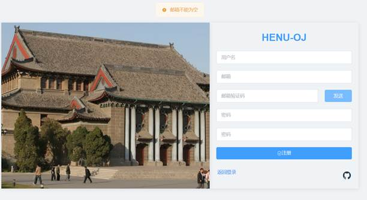

###### Figure 4.1 User Registration Page

2) Personal Center
The personal center is mainly used to display users' personal information. Users can also edit their personal profiles and reset their passwords. The system's personal center page is shown in the figure below.

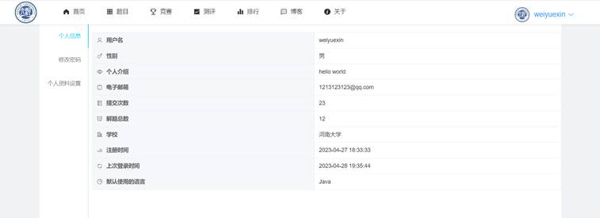

3) Viewing Questions
Users can view the question list in pages on the question list page, which includes information such as question names, difficulty levels, submission times, and pass rates. The question details page allows users to view detailed question information and submit code. Figure 4.3 shows the question list page, and the following figure shows the question details page.

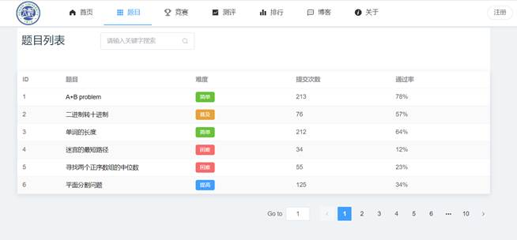
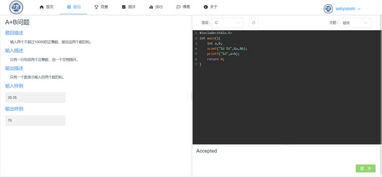

4) Code Evaluation
Code evaluation is carried out after submitting code on the page shown in Figure 4.4 above. The code evaluation process is as follows:
1. The user submits the code.
2. A code security check is performed to ensure that there is no code input that could harm the system's operation.
3. Compile the code (this step is not required for languages that do not need compilation).
4. Run the test cases one by one and check if the output results match the correct results.
5. After all test cases have been run, return the results to the user.

5) Article Publishing
On the article publishing page, users need to fill in the title, category, and body of the article. The article publishing page is shown in the figure below.

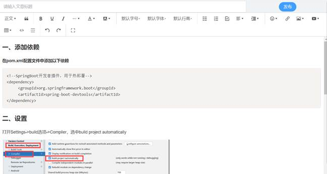

#### (II) Administrator Module
1) User Management
Administrators can manage registered users in the system. The user management page is shown in the figure below.

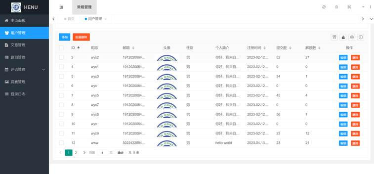

2) Question Management
Administrators can manage the questions in the current system. The question management page is shown in the figure below.

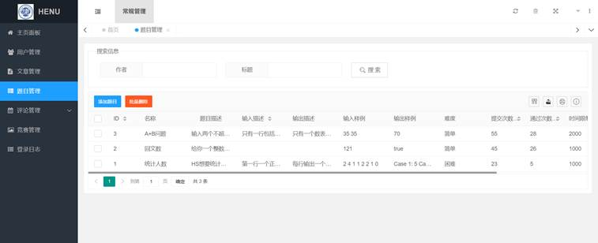

3) Evaluation Management
After entering the evaluation management module, administrators can view question evaluation records. These evaluation records are generated when users submit code for evaluation. The evaluation management page is shown in the figure below.

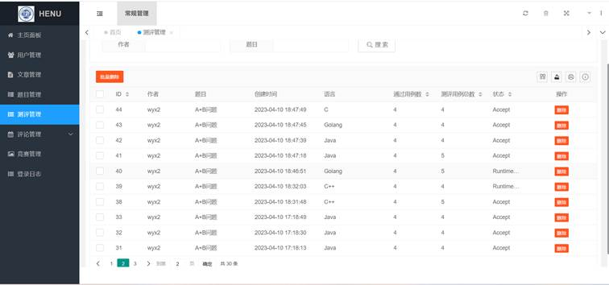

4) Competition Management
Administrators are the only ones in the system who can manage competitions. Competition management includes operations such as viewing, creating, and deleting competitions. When creating a competition, the start and end times of the competition need to be set. The competition management page is shown in the figure below.

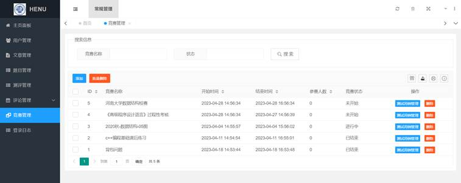

5) Article Management
Administrators can manage articles, including viewing the article list and deleting articles. The article management page is shown in the figure below.

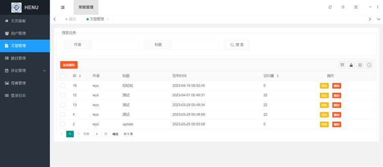

### Academic Integrity Reminder
This online code evaluation system is designed to provide a fair and just environment for code learning and assessment. When using this system, users are required to maintain high - level academic integrity. Any form of plagiarism, cheating, or using unauthorized means to obtain answers is strictly prohibited. This includes but is not limited to copying code from others, using external code libraries without permission, and colluding with others during assessments. Violation of academic integrity not only undermines the fairness of the evaluation but also goes against the principles of learning and self - improvement. Please respect the intellectual property rights of others and abide by the rules of the system to ensure the authenticity and validity of your learning and assessment results.